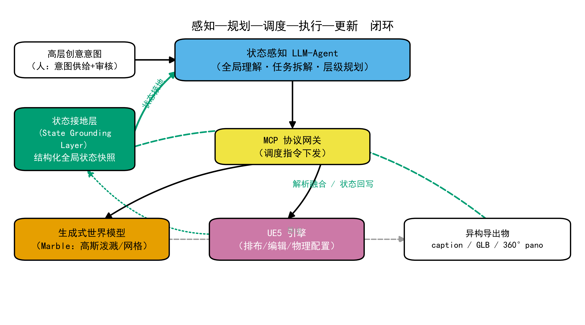
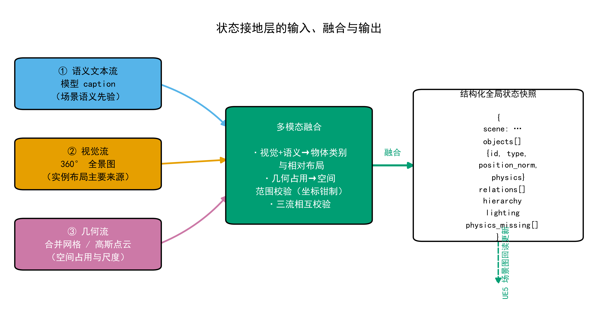
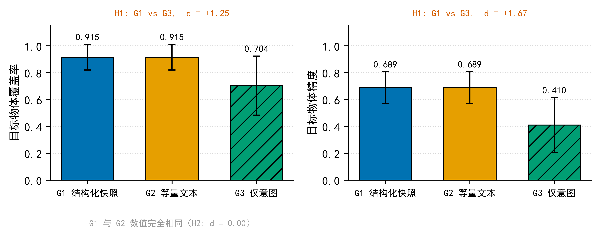
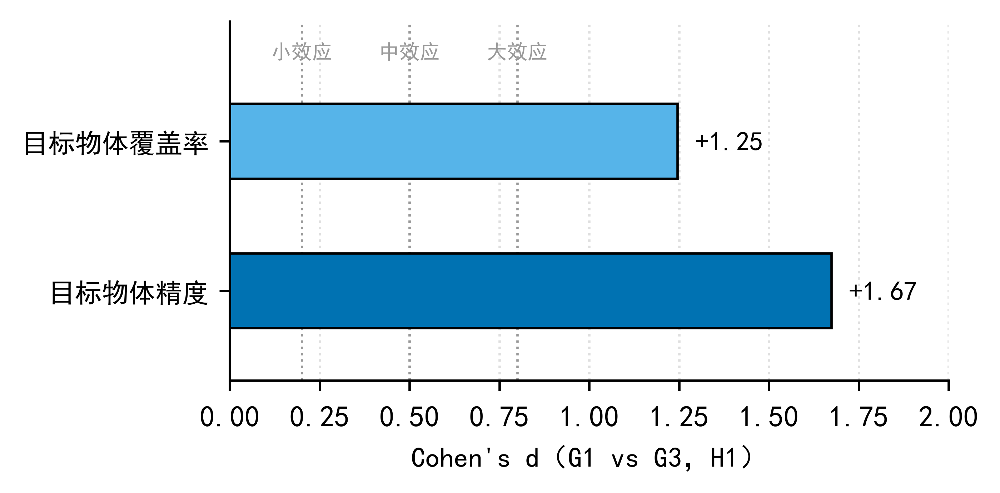
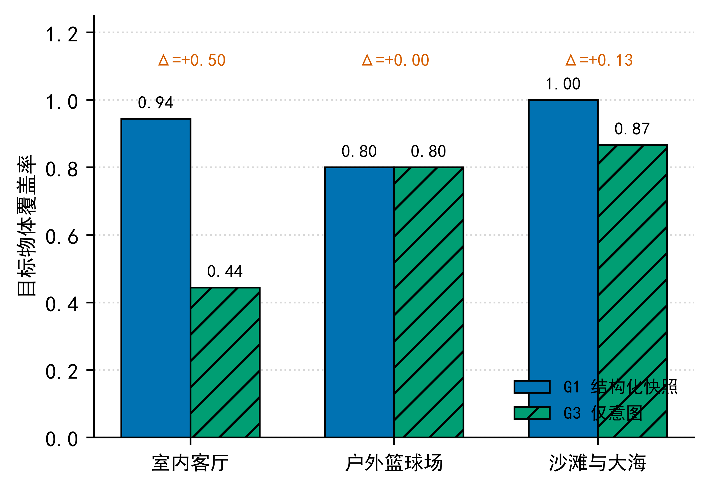

# 面向游戏场景生产的生成式世界模型状态接地与智能体调度管线

**State Grounding and Agent Scheduling Pipeline for Generative World Models in Game Scene Production**

[](https://www.python.org/)
[](LICENSE)
[](#-项目状态与边界)

> 一套可运行的场景生产管线：把生成式世界模型的**非结构化导出物**解析为**可推理的全局场景状态**，
> 由大语言模型智能体据此完成**规划—调度**，并用**程序化指标**量化验证。
> 本文记录了完整的工程实现、对照实验设计，以及一个与直觉相反的关键发现。

---

## 一页速览

| 项 | 内容 |
|---|---|
| **问题** | 生成式世界模型能"生成场景"，但输出是纯几何+一句话描述，**不含物体级结构化状态**，上层管线无法做全局一致性推理；全局规划调度只能靠人工 |
| **我做了什么** | ① 实测证明世界模型导出物**无语义标签、网格是单一合并几何**；② 自建**状态接地层**（多模态视觉+几何占用融合）；③ 构建**智能体调度闭环**；④ 设计**3 组对照 + 消融**实验量化验证 |
| **规模** | 3 个场景 × 9 个冻结世界 × 3 种条件 = **27 份调度方案**，全部真实运行、真实测量 |
| **核心结论 1** | 状态接地让目标物体覆盖率 **0.704 → 0.915**（Cohen's *d* = **1.25**）、精度 **0.410 → 0.689**（*d* = **1.67**） |
| **核心结论 2（反直觉）** | 信息量对等时，**结构化快照相对等量自然语言毫无额外增益**（*d* = **0.00**，9/9 世界完全相同）；且在 N=50 时结构化输出**更易解析失败** |



*图 1　状态感知智能体调度管线的闭环数据流：意图 → 智能体规划 → MCP 网关 → 世界模型/引擎 → 导出物 → 状态接地层 → 回写更新*

---

## 目录

- [问题背景](#问题背景)
- [系统架构](#系统架构)
- [核心技术点：状态接地层](#核心技术点状态接地层)
- [实验设计与结果](#实验设计与结果)
- [关键发现（含一个负结果）](#关键发现含一个负结果)
- [主动修正的一个数据污染](#主动修正的一个数据污染)
- [仓库结构](#仓库结构)
- [复现方式](#复现方式)
- [技术栈](#技术栈)
- [项目状态与边界](#项目状态与边界)
- [许可](#许可)

---

## 问题背景

生成式三维内容技术（3D Gaussian Splatting、文本驱动的世界模型）使"一段文字生成可渲染场景"成为现实，单资产的生成门槛大幅降低。但**生成能力 ≠ 生产流程自动化**：

游戏场景生产不是孤立资产的堆叠，而是包含**顶层规划、资产调度、空间编排、物理配置**的系统工程——物体之间存在空间关联、层级归属与物理约束，整体合理性取决于**全局一致的规划**。

当前把生成模型接入生产管线的方式，通常以单次文本/图像意图为单位产出资产，模型自身**既不持有也不维护全局场景状态**，导致：

1. **全局状态缺失**——输出无物体级结构化状态，管线无法做跨资产、跨批次的一致性推理；
2. **调度自动化程度低**——全局认知、空间约束推理、任务拆解长期依赖资深策划的隐性经验；
3. **结果一致性差**——无统一状态记录，批次间质量波动大。

**共性根源**：在既定的资产生成能力之上，缺少一个能维护全局状态并据此规划调度的上层机制——这正是本项目的切入点。

---

## 系统架构

管线采用"**生成式世界模型基底 + 独立上层规划调度层**"的分层设计，遵循 `感知—规划—调度—执行—更新` 五阶段闭环。

| 层 | 组件 | 职责 | 实现状态 |
|---|---|---|---|
| 基底 | Marble 世界模型（`marble-1.1`） | 文本 → 动态高斯场景/网格/全景图 | ✅ 已接入真实 API |
| 中间 | **状态接地层** | 异构导出物 → 结构化全局状态快照 | ✅ 已实现并实测 |
| 上层 | **状态感知 LLM-Agent** | 全局理解、任务拆解、层级规划 | ✅ 已实现并实测 |
| 执行 | MCP 协议网关 + 引擎 | 驱动资产生成 / 场景编辑排布 | ⚠️ 网关调度逻辑已实现；引擎侧需第三方 3DGS 插件，未实测 |
| 度量 | 程序化指标 + 效应量 | 覆盖率、精度、重叠、一致性 | ✅ 已实现并实测 |

**一个刻意的架构约束**：底层生成能力**完全沿用公开模型，不做任何训练、微调或算法改造**。全部工作收敛在上层的状态接地与调度逻辑。这样既保证系统能复用现成能力，也让实验中的底层生成能力保持一致——**架构增益才能被干净地归因**。

---

## 核心技术点：状态接地层

### 为什么必须自建（实测依据）

我对世界模型的公开接口做了实际调用，验证其导出物构成：

| 导出物 | 实测结果 | 影响 |
|---|---|---|
| `semantics_metadata` | 仅 `metric_scale_factor`、`ground_plane_offset` **两个标量** | 无物体级语义 |
| 碰撞网格（GLB，约 10.8 万面） | **单一合并几何**，连通域分割仅得 2 个成分；节点名仅 `world`/`geometry_0` | **无法**从几何恢复物体 |
| caption | 质量高，含物体/材质/关系 | **但实测发现：同一提示词下不同世界实例的 caption 逐字节完全相同**（md5 一致）→ 只反映提示词语义，**不反映实例布局** |
| 360° 全景图 | 正式模型提供 | 成为实例布局的**主要语义来源** |

**结论**：世界模型的输出=纯几何 + 一句话描述，**没有结构化物体级场景图**。若直接交给语言模型，智能体缺乏可推理的全局状态，极易幻觉或错调。

### 三流融合设计



*图 2　状态接地层的输入流、融合策略与结构化状态输出*

| 输入流 | 角色 | 理由 |
|---|---|---|
| **语义文本流**（caption） | 场景语义先验 | 质量高，但**与实例无关**（见上表实测） |
| **视觉流**（360° 全景图） | **实例布局的主要来源** | 几何流切不出物体、caption 无实例信息 → 视觉是唯一可靠途径 |
| **几何流**（合并网格/高斯点云） | 空间占用与尺度**校验** | 无物体标签，故不承担切分；用于约束坐标范围 |

融合后用**多模态大模型**完成开放词表物体识别，输出结构化快照：

```json
{
  "scene": "modern_living_room",
  "objects": [
    {
      "id": "sectional_sofa",
      "type": "curved sectional fabric sofa",
      "position_norm": [0.0, -0.55, 0.35],
      "physics": { "collision": "mesh", "material": "fabric", "rigid": false },
      "confidence": 0.95,
      "evidence": "both"
    }
  ],
  "relations": [ { "subject": "sofa", "object": "floor", "relation": "on" } ],
  "hierarchy": { ... },
  "physics_missing": [ ... ]
}
```

> **开放词表是关键设计**：接地层**不接收任务书的目标物体清单**（否则覆盖率指标恒为 1、沦为循环论证），而是自由识别场景内容；真值在测量阶段用独立任务书比对。

---

## 实验设计与结果

### 三组对照 + 一处严格消融

| 组别 | 状态输入 | 作用 |
|---|---|---|
| **G1** | 结构化状态快照（接地层输出） | 本文架构 |
| **G2** | 与快照**信息量对等**的非结构化文本 | 检验"结构化是否带来增益" |
| **G3** | 仅高层创意意图文本 | 检验"状态接地是否有价值" |

**G1 vs G2 是严格单一变量对照**：同一模型、同一提示词模板、同一任务、同一生成预算，唯一差异是状态输入形式。以 **token 计量**对齐信息量，实测差异控制在 **0–5%**。

**关键实验控制**：先用固定提示词为 3 个场景各生成 3 个世界并**冻结**，三组复用**同一批资产**——使组间差异可归因于调度与状态输入，而非生成随机性。

### 结果

**H1：状态接地的信息价值 —— 支持**



*图 3　三条件在覆盖率与精度上的均值 ± 标准差（n=9 冻结世界/组）*

| 指标 | G1（结构化） | G2（等量文本） | G3（仅意图） | G1 vs G3 效应量 |
|---|---|---|---|---|
| 目标物体覆盖率 | 0.915 ± 0.096 | 0.915 ± 0.096 | 0.704 ± 0.220 | **+1.25** |
| 目标物体精度 | 0.689 ± 0.118 | 0.689 ± 0.118 | 0.410 ± 0.204 | **+1.67** |
| 物体重叠对数 | 3.11 ± 1.60 | 3.11 ± 1.60 | 5.11 ± 6.76 | −0.41 |

逐世界胜负：G1 优于 G3 的 **6 个世界**、持平 2 个、落后 1 个。



*图 4　H1 的效应量（Cohen's d），覆盖率与精度均达大效应*

**任务依赖性 —— 状态接地并非处处有效**



*图 5　分场景覆盖率对比*

| 场景 | G1 | G3 | Δ |
|---|---|---|---|
| 室内客厅（家具组合具特定性） | 0.944 | 0.444 | **+0.500** |
| 户外篮球场（物体高度常识化） | 0.800 | 0.800 | 0.000 |
| 沙滩与大海 | 1.000 | 0.867 | +0.133 |

**解释**：篮球场的篮筐、篮球、长椅高度常识化，无状态也能凭常识猜全；客厅的家具组合与布局更具特定性。
→ **状态接地的价值取决于任务所需信息是否超出常识**。这界定了方法的适用条件。

---

## 关键发现（含一个负结果）

### 发现 1：结构化表示在强模型下**无额外增益**

G1 与 G2 的**覆盖率、精度、重叠对数三项指标在 9/9 世界中逐一完全相同**（*d* = 0.00）。
进一步逐对象核对：**物体位置在 9/9 世界中完全相同**（位置偏移均值 0.0000）。

两者方案仅存在格式性差异（类型命名连接符、对象排序），**无内容实质区别**。

**工程启示**：当语言模型自身解析能力足够强时，投入复杂结构化 schema（对象图、关系表、物理参数矩阵）**未必带来收益**——信息量对等的前提下，简洁的文本化状态可能更具性价比。

### 发现 2：规模增大时结构化表示**更脆弱**

构造物体数 N = 5/15/30/50 的合成场景重复实验：各规模下指标仍一致，但 **N=50 时结构化输出出现自然语言组未出现的解析失败**（长 JSON 被截断）。

→ 重型 schema 在规模上升时附带**格式脆弱性成本**。

### 发现 3：caption 与实例无关（工程陷阱）

同一提示词下、不同世界实例的 **caption 逐字节完全相同**（md5 一致），而几何与全景图确实不同。

→ 若照搬"读 caption 做接地"的朴素方案，会得到**对所有实例相同**的状态，管线失效。这是本项目必须引入视觉流的直接原因。

---

## 主动修正的一个数据污染

在准备正式实验时，我发现 **pilot 世界（living_room/world_1）的方案文件由早期的"诊断-修复"任务生成**，而其余 8 个世界是"转录"任务——**两者任务不同，不可混用**，会污染全部结果。

处理：**删除全部 27 份方案，用统一任务重跑**，再重新测量。这也使最终结果比首轮更干净、效应量更强（覆盖率 *d* 由 1.17 修正为 **1.25**）。

> 项目方法论：负面/异常结果不掩盖。`docs/` 中另有关于 GLB 几何解析失败的实测记录，以及全部 6 种任务设计的探索记录（含两次互相矛盾、最终判定为噪声的结果）。

---

## 仓库结构

```
game-scene-agent-pipeline/
├── README.md
├── LICENSE
├── requirements.txt
├── figures/                 # 5 张出版级插图（600dpi PNG + 矢量 PDF）
│   ├── 01_pipeline_architecture.*
│   ├── 02_state_grounding_layer.*
│   ├── 03_main_results.*
│   ├── 04_effect_size.*
│   └── 05_task_dependence.*
├── scripts/                 # 11 个可运行脚本
│   ├── 01_freeze_assets.py          # 生成并冻结资产池
│   ├── 02_build_inputs.py           # 构造三组状态输入 + 信息量对账
│   ├── 03_parse_grounding.py        # 几何占用分析
│   ├── 04_measure.py                # 程序化测量
│   ├── 05_grounding_multimodal.py   # 状态接地层（多模态融合，核心）
│   ├── 06_agent_schedule.py         # 智能体调度
│   ├── 07_measure_plan.py           # 方案测量
│   └── 08–11_*.py                   # 消融/规模/能力/边界测试
├── data/
│   ├── worlds/              # 9 个冻结世界的状态快照、调度方案、输入
│   ├── preview/             # 9 张全景预览图
│   └── results/             # 原始测量结果 CSV
└── docs/
    ├── 实验结果.md           # 完整实验记录（含污染修正）
    └── 几何解析实测发现.md    # GLB 解析失败的实测证据
```

---

## 复现方式

```bash
pip install -r requirements.txt

# 1) 生成并冻结资产池（需要世界模型 API Key）
export WLT_API_KEY=your_key
python scripts/01_freeze_assets.py

# 2) 构建状态接地层 → 结构化快照
export DEEPSEEK_API_KEY=your_key
python scripts/05_grounding_multimodal.py

# 3) 构造三组输入（含信息量对账）
python scripts/02_build_inputs.py

# 4) 智能体调度 → 三组方案
python scripts/06_agent_schedule.py

# 5) 程序化测量与汇总
python scripts/07_measure_plan.py
```

> **无需 API Key** 的路径：`data/` 中已包含 9 个世界冻结后的状态快照、三组调度方案与原始测量结果，
> 可直接运行 `scripts/07_measure_plan.py` 复现全部统计结论。

---

## 技术栈

| 类别 | 使用 |
|---|---|
| 语言 | Python 3.11 |
| 生成模型 | Marble World API（`marble-1.1`）——文本→高斯场景/网格/全景图 |
| 多模态理解 | DeepSeek-V4.1-Flash（图像+文本 → 结构化场景状态） |
| 智能体调度 | 多模态大语言模型 + 结构化输出约束 |
| 几何处理 | trimesh（体素占用分析、连通域分割、包围盒） |
| 数据与统计 | numpy、pandas、Cohen's d 效应量 |
| 可视化 | matplotlib（Okabe-Ito 色盲友好配色 + 纹理冗余编码） |
| 协议 | MCP（Model Context Protocol，调度指令下发） |
| 目标引擎 | UE5（场景编辑/排布/物理配置） |

---

## 项目状态与边界

**已完整实现并实测**
- 真实世界模型 API 接入与资产冻结（9 个世界）
- 状态接地层：多模态融合 + 结构化快照（含实测发现的工程陷阱处理）
- 智能体调度：三组条件的方案生成
- 程序化测量：11 项指标 + 效应量统计
- 对照实验与消融设计的完整执行
- 数据污染的自查与修正

**设计完成、未实测**
- MCP 网关对 UE5 的实际驱动：调度指令的**生成**已实现，但引擎侧执行依赖第三方 3DGS 渲染插件（多为付费/beta），本项目未做端到端引擎验证
- 流体/布料的动力学合理性量化：需物理仿真引擎支持，列为探索性指标

**诚实标注**
- 每个场景仅 3 个冻结世界（n=9/组），以**效应量与离散度**为主要判据，不追求大样本统计显著性
- 结论基于单一生成模型基底与单一语言模型，向其他模型的迁移性待验证
- 本文采用"产出场景方案"作为真实管线调度的**代理任务**，向完整生产管线的外推需谨慎

---

## 许可

代码以 [MIT](LICENSE) 许可发布。`data/` 中的场景资产由商业世界模型服务生成，**受其服务条款约束**，仅限研究与非商业用途，请勿单独再分发。

---

## 关于

**李坚成** · 广西艺术学院
研究方向：人工智能与数字艺术设计 / 游戏技术

本仓库是同名研究论文（投稿中）的工程实现与数据附录。
论文另附：完整的参考文献（17 篇，含 DOI）、投稿材料包、出版级插图。

> 若本项目对你有帮助，欢迎 Star ⭐ 或提 Issue 交流。
